# **스마트 기기 기반 사무 통합 관리 시스템** "MOASS"

# :clipboard: 소개
### 사용자 맞춤형 업무 보조를 제공하는 서비스, MOASS. 
명패라는 사무 도구를 스마트 기기로 고도화시켜, 더 편리한 사무 환경을 제공합니다. 관리자는 직관적으로 근태, 좌석 배치 현황을 관리하고 시설 및 예약 테이블을 손쉽게 만들 수 있고, 교육생은 JIRA, MataMattermostmost, GitLab, 공용 그림 보드, 시설 및 회의실 예약 등 업무에 연관된 부가적인 일들을 한곳에서 해결하여 업무의 효율을 높일 수 있습니다.
 

### 소개 영상. 
- YouTube 링크
 

# :date: 프로젝트 진행 기간
| 프로젝트 기간 | 2024.04.08 ~ 2024.05.17 (6주) |
| --- | --- |

# :family: 팀 소개

|**[서지수](https://github.com/Bada35)**|**[한성주](https://github.com/RosaDamascena)**|**[이동호](https://zircon-iguana-6e3.notion.site/f5e94fbfc279454b8683b256bfc980bf?pvs=4)**|**[원종현](https://github.com/www-jong)**|**[손종민](https://tasteful-libra-0be.notion.site/SSAFY-IT-_-e85fc8f05a7f4f89bf8dd61f995d95b9)**|**[장현욱](https://github.com/JhyunW)** |
| :---------------------------------------------------------------------------------------------------------------------------: | :---------------------------------------------------------------------------------------------------------------------------: | :---------------------------------------------------------------------------------------------------------------------------: | :---------------------------------------------------------------------------------------------------------------------------: | :---------------------------------------------------------------------------------------------------------------------------: | :---------------------------------------------------------------------------------------------------------------------------: |
|Embedded/팀장|Embedded|Backend|Backend|Frontend|Frontend|

 

# :exclamation: 기획 의도
### 이 프로젝트를 시작한 이유. 
  이 프로젝트는 교육장 내에서 교육생과 관리자 분들이 겪는 다양한 불편함을 해결하기 위해 시작되었습니다.
  - 교육생의 불편함:
    - 교육생들은 너무 많은 알림이 많아요!
    - 확인해야 하는 일정과 정보들이 여기저기 흩어져 있어요!
    - 회의 시 그림을 간단히 그리면서 설명하고 싶어요.

  - 관리자의 불편함:
    - 교육생의 위치와 반이 매번 바뀌어 외우기 힘들어요.
    - 전달할 사항이 있는데 해당 교육생이 자리에 있는지 모르겠어요.
    - 회의실, 시설 등의 예약 테이블을 매번 만드는 게 불편해요.
  
  이 모든 불편한 업무들을 한곳에서 관리하고 확인할 수 있는 방법을 찾고자 했습니다. 이 아이디어를 바탕으로 교육장 내에서 항상 존재하는 명패와 결합하여 스마트 명패 '모아스'가 탄생했습니다!

  스마트 명패 '모아스'는 교육생과 관리자 모두의 불편함을 해결하고, 효율적인 교육 환경을 조성하기 위해 제작되었습니다.

# :speech_balloon: 서비스 기능 소개
## 교육생 기능
### 1️⃣ 알림 모아스. 
  - EDU SSAFY 일정(교육 일정) 알림 및 확인
  

  - MM, GItLab(공지, 코드 리뷰) 알림
  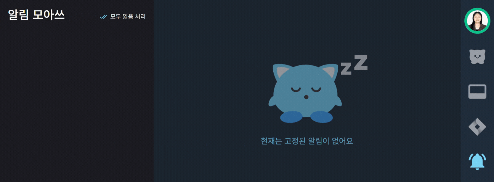
  - MM, 기기 로그인 모바일 알림 
  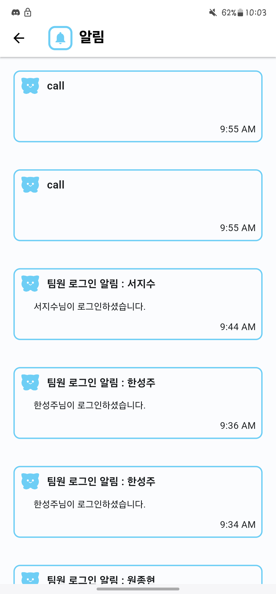{: width="200" height="400"}
  
  - 원하는 GitLab 확인
 
  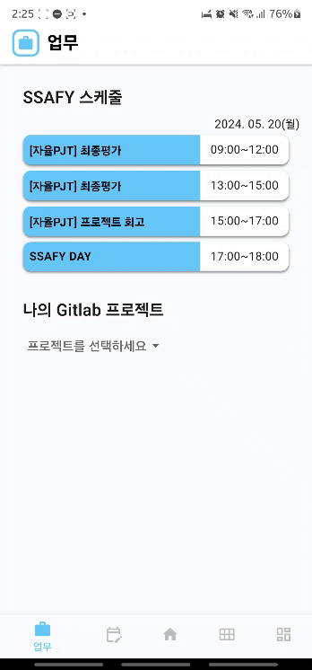
 

### 2️⃣ 업무 관리. 
  - Jira(스케줄) 관리
  
 

### 3️⃣ 이음 보드. 
  - 동시 편집 화이트 보드
   
  
  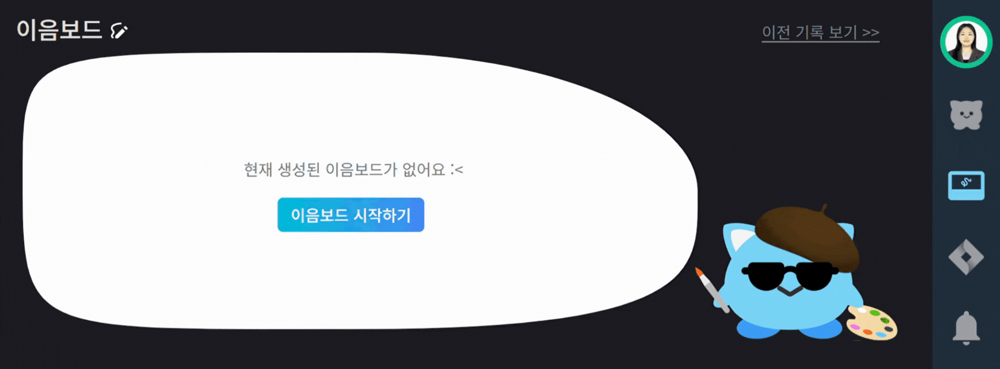
  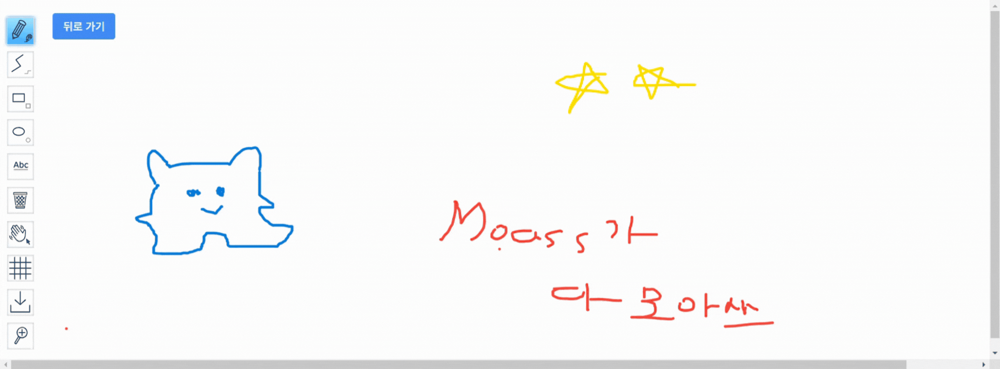
  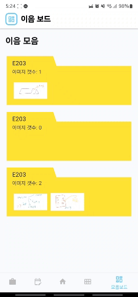

 

### 4️⃣ 예약 보드 현황 및 예약. 
  - 예역 현황 체크 및 예약 기능
 
  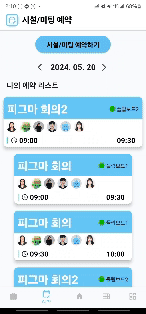
 

## 관리자 기능
### 1️⃣ 실시간 좌석도 및 현황. 
 
  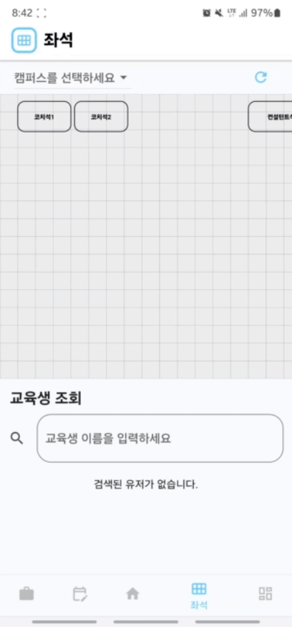
 

### 2️⃣ 교육생 착석 유무 확인. 
  
  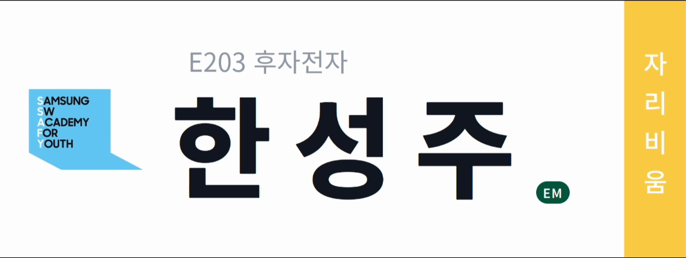
 

### 3️⃣ 호출. 
  - 교육생 호출
  
  
 

### 4️⃣ 예약 보드 현황 및 생성. 
  - 예약 보드 현황
  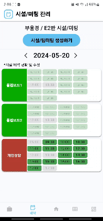
 

# :clipboard: 기술 소개
  - NFC 센서 : 기기 고유 넘버와 카드의 고유 UID를 이용해 로그인
  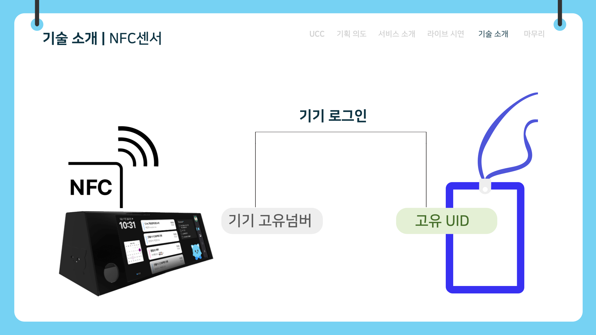{: width="600" height="400"}

  - 비콘 : 비콘을 이용해 RSSI값을 받아와 위치 특정
  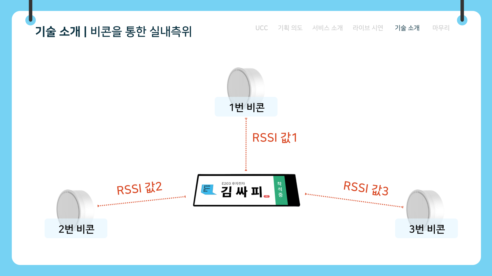{: width="600" height="400"}

  - 웹소켓 : 웹소켓을 이용해 실시간 통신으로 이음보드 구현
  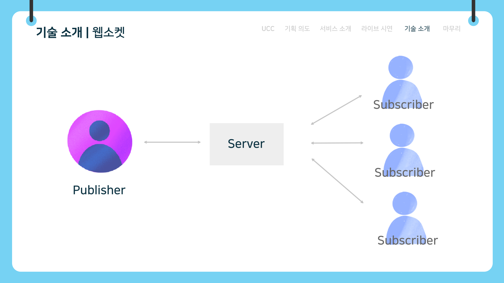{: width="600" height="400"}

  - 리액티브 & 웹플럭스 : 비동기 및 논블로킹 I/O를 사용하여 요청을 처리 하여 서버 자원을 효율적으로 사용하고 높은 동시성을 유지
  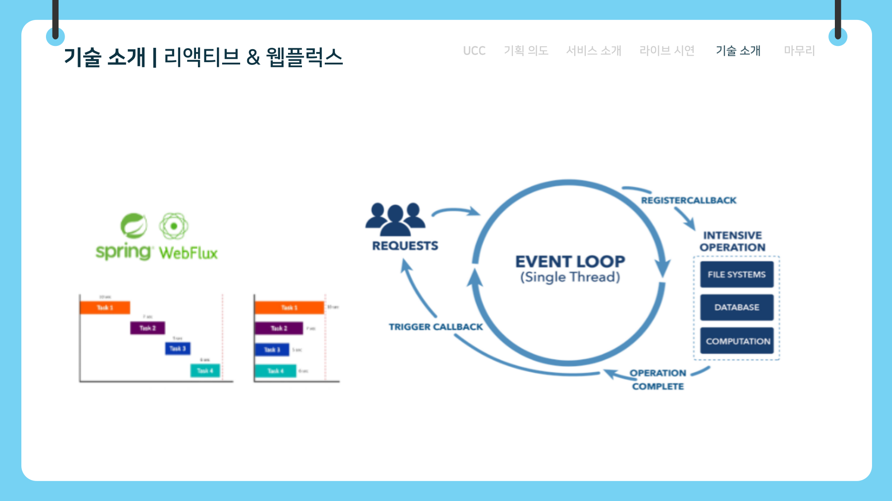{: width="600" height="400"}

  - SSE : 실시간 페이지 갱신 및, 알람기능 구현
  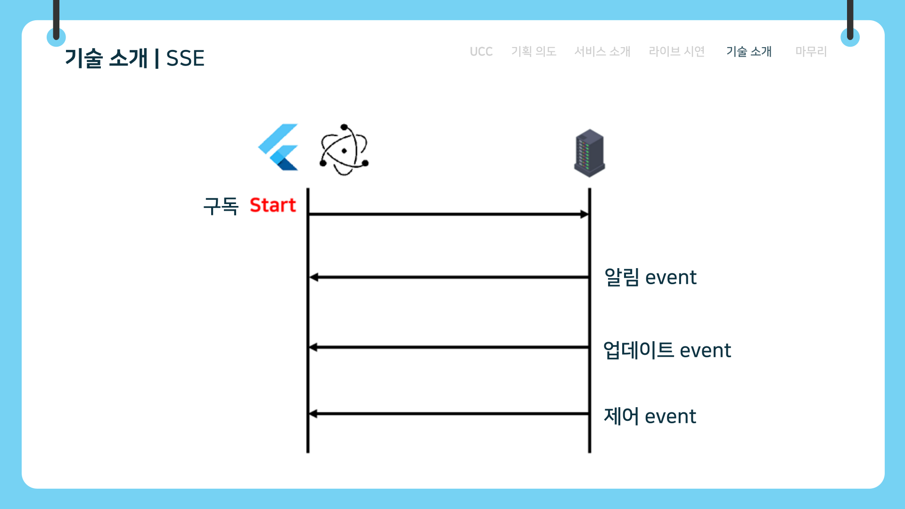{: width="600" height="400"}

 
