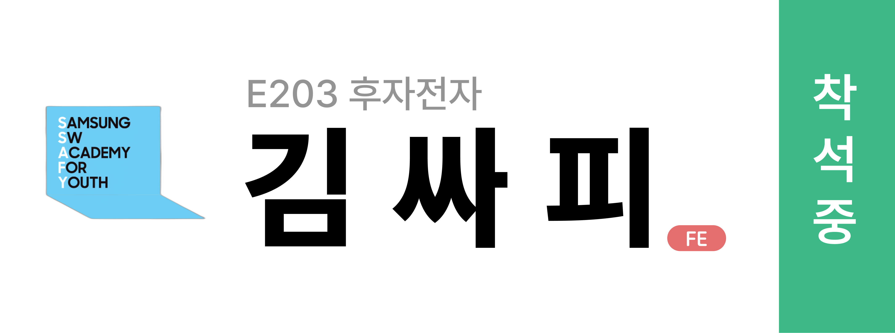

# **스마트 기기 기반 사무 통합 관리 시스템** "일-잇다"

# :clipboard: 소개
### 사용자 맞춤형 업무 보조를 제공하는 서비스, 일 잇다. 
명패라는 사무 도구를 스마트 기기로 고도화시켜, 더 편리한 사무 환경을 제공합니다. 관리자는 직관적으로 근태, 좌석 배치 현황을 관리할 수 있고, 사용자는 스케줄 관리 등 업무 보조 기능을 제공받을 수 있습니다. 또한 회의 내용 녹음, 실시간 발화 표출, 요약 기능을 통해 업무의 효율을 높일 수 있습니다.
 

### 소개 영상. 
영상 링크 달기
 

# :date: 프로젝트 진행 기간
| 프로젝트 기간 | 2024.04.08 ~ 2024.05.17 (6주) |
| --- | --- |

# :family: 팀 소개

|**[서지수](https://github.com/Bada35)**|**[한성주](https://github.com/RosaDamascena)**|**[이동호](https://zircon-iguana-6e3.notion.site/f5e94fbfc279454b8683b256bfc980bf?pvs=4)**|**[원종현](https://github.com/www-jong)**|**[손종민](https://tasteful-libra-0be.notion.site/SSAFY-IT-_-e85fc8f05a7f4f89bf8dd61f995d95b9)**|**[장현욱](https://github.com/JhyunW)** |
| :---------------------------------------------------------------------------------------------------------------------------: | :---------------------------------------------------------------------------------------------------------------------------: | :---------------------------------------------------------------------------------------------------------------------------: | :---------------------------------------------------------------------------------------------------------------------------: | :---------------------------------------------------------------------------------------------------------------------------: | :---------------------------------------------------------------------------------------------------------------------------: |
|Embedded/팀장|Embedded|Backend|Backend|Frontend|Frontend|

 

# :exclamation: 기획 의도
### 이 프로젝트를 시작한 이유. 
불편사항 적기
 

# :speech_balloon: 서비스 기능 소개
## 교육생 기능
### 1️⃣ 알림 모아스. 
  - EDU SSAFY 일정 (교육 일정) 알림
  (모바일, 기기 사진추가)
  - MM, GItLab(공지, 코드 리뷰) 알림
  (모바일, 기기 사진추가)
 

### 2️⃣ 업무 관리. 
  - Jira(스케줄) 관리
  (기기 사진추가)
 

### 3️⃣ 이음 보드. 
  - 동시 편집 화이트 보드
  (기기 사진 GIF 및 모바일 저장 화면)

 

### 4️⃣ 예약 보드 현황 및 예약. 
  - 예역 현황 체크 및 예약 기능
  (모바일 예약 현황 => 예약하기 GIF)
 

## 관리자 기능
### 1️⃣ 실시간 좌석도 및 현황. 
  - 교육생의 좌석 위치 확인
  (모바일 좌석)
  - 교육생의 현황 확인
  (모바일 좌석도)
 

### 2️⃣ 교육생 현황. 
- 교육생의 현황 확인
  (모바일 좌석도)
 

### 3️⃣ 호출. 
  - 교육생 호출
  (교육생 호출 및 호출 받는 화면)
 

### 4️⃣ 예약 보드 현황 및 생성. 
  - 예약 보드 현황
  (예약 현황 확인)
  - 예약 테이블 생성
  (예약 테이블 생성)
 

# :clipboard: 기술 스택
### 스택 소개. 
  - ED: 
  - BE:
  - FE:
 

# :clipboard: 기대 효과
### 기대 효과 

 

# :clipboard: 아키텍쳐
### 아키텍쳐. 

 
